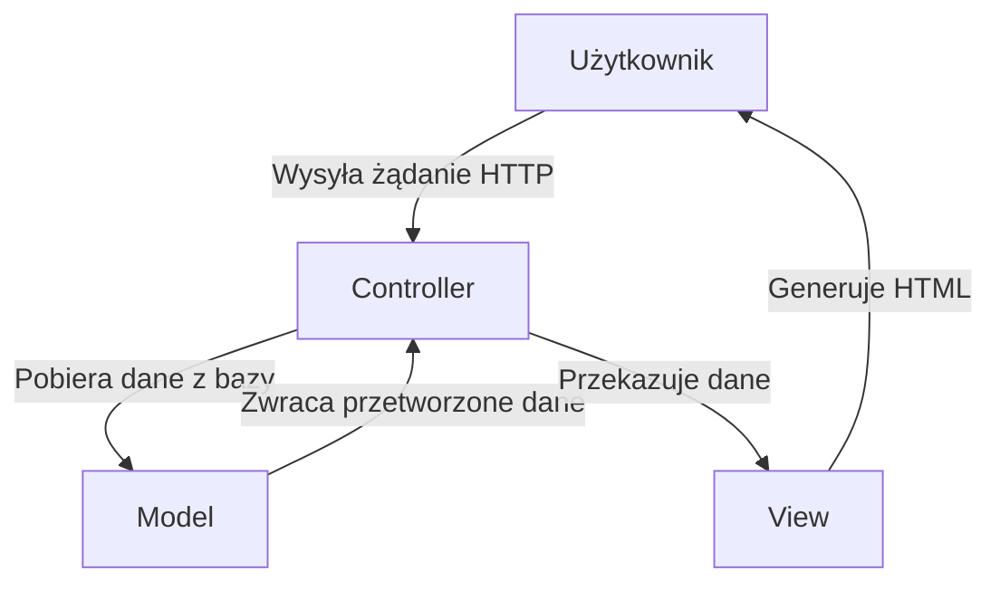
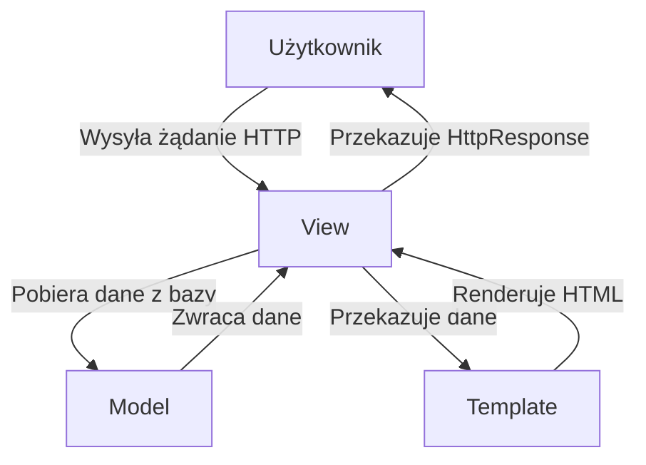

## Wzorce projektowe

Wzorce projektowe to sprawdzone sposoby rozwiązywania powtarzających się problemów w projektowaniu oprogramowania. Pomagają one organizować kod, ułatwiają zarządzanie projektem i poprawiają jego czytelność oraz skalowalność. Dwa popularne wzorce stosowane w aplikacjach webowych to MVC (Model-View-Controller) oraz MVT (Model-View-Template).

---

## Logika biznesowa i logika aplikacji

W pracy dewelopera często pojawia się potrzeba implementowania pewnej logiki - czyli sposobu realizacji pewnych zadań.
Zadania te możemy podzielić na dwa rodzaje:

- Logika biznesowa - odpowiada na pytania "co ma się wydarzyć" (np. złożono zamówienie, więc trzeba zarezerwować produkt, zaktualizować stan magazynu, wysłać wiadomość e-mail do klienta),
- Logika aplikacji - odpowiada na pytania "jak to zrobić" (np. "użyj metody ORM do aktualizacji tabeli w bazie danych").


## Wzorzec MVC (Model-View-Controller)



Wzorzec MVC dzieli aplikację na trzy warstwy:

1. **Model:**
   - Reprezentuje dane aplikacji (np. tabelę w bazie danych). Zawiera logikę biznesową (np. operacje na danych). Uwaga - zamiast umieszczać logikę biznesową w modelu, wyodrębnia się ją często do osobnego modułu (np. `services.py`), co pozwala na lepsze zarządzanie kodem i jego testowanie. Pewne elementy logiki, szczególnie te mocno związane z danymi reprezentowanymi przez model, czasem jednak warto pozostawić w modelu.
   - Zajmuje się operacjami na danych, takimi jak pobieranie, zapisywanie czy walidacja. Zaimplementowane więc są tutaj pewne metody logiki aplikacji. Użycie ich jest jednak realizowane przez kontroler.

2. **View (Widok):**
   - Odpowiada za prezentację danych dla użytkownika.
   - Generuje interfejs użytkownika na podstawie danych dostarczonych przez model i kontroler.

3. **Controller (Kontroler):**
   - Odpowiada za logikę aplikacji.
   - Przyjmuje żądania od użytkownika, przetwarza je, a następnie zwraca odpowiedni widok.


### Przykład MVC w aplikacji webowej:
Załóżmy, że mamy aplikację do zarządzania zadaniami:

- **Model:** Klasa `Task`, reprezentująca tabelę zadań w bazie danych.
  ```python
  class Task:
      def __init__(self, title):
          self.title = title
          self.subtasks: Optional[list[Task]] = []
          self.is_completed = False


      def save(self):
          # Zapisz zadanie do bazy danych
          # element logiki aplikacji
          pass

      def check_if_completed(self):
          # element logiki biznesowej
          # sprawdzenie, czy wszystkie podzadania są wykonane jeśli są podzadania
          # jeśli nie ma podzadań, to zwróć wartość is_completed
          if self.subtasks:
            return all(subtask.is_completed for subtask in self.subtasks)
          return self.is_completed

      def get_all(self):
          # element logiki biznesowej
          # pobieranie wszystkich zadań
          pass
  ```

- **View:** Plik HTML, wyświetlający listę zadań.
  ```html
  <ul>
      
          <li>{{ task.title }} - {{ "Done" if task.is_completed else "Pending" }}</li>
      
  </ul>
  ```

- **Controller:** Funkcja obsługująca żądanie i dostarczająca dane do widoku.
  ```python
  def get_tasks(request):
      tasks = Task.get_all()
      return render(request, "tasks.html", {"tasks": tasks})
  ```

---

## Wzorzec MVT (Model-View-Template)



Wzorzec MVT jest stosowany w Django i jest podobny do MVC, ale wprowadza pewne istotne różnice:

1. **Model:**
   - Reprezentuje dane i logikę biznesową, podobnie jak w MVC. Zaimplementowane są tutaj pewne metody logiki aplikacji.
   - W Django model jest implementowany jako klasa ORM.

2. **View (Widok):**
   - Odpowiada za logikę aplikacji i obsługuje żądania HTTP.
   - W Django widok to funkcja lub klasa, która pobiera dane z modelu i wypełnia nimi szablon. Tak wypełniony szablon widok zwraca jako obiekt HttpResponse.

3. **Template (Szablon):**
   - Generuje HTML na podstawie danych przekazanych z widoku.
   - Używa systemu tagów i filtrów szablonów Django.

### Przykład MVT w Django:

- **Model:**
  ```python
  from django.db import models

  class Task(models.Model):
      title = models.CharField(max_length=255)
      is_completed = models.BooleanField(default=False)
      subtasks = models.ManyToManyField("self", blank=True)

      def check_if_completed(self):
          # element logiki biznesowej
          # sprawdzenie, czy wszystkie podzadania są wykonane jeśli są podzadania
          # jeśli nie ma podzadań, to zwróć wartość is_completed
          if self.subtasks.exists():
            return all(subtask.is_completed for subtask in self.subtasks.all())
          return self.is_completed
  ```

- **View:**
  ```python
  from django.shortcuts import render
  from .models import Task

  def task_list(request):
      tasks = Task.objects.all()
      return render(request, "tasks.html", {"tasks": tasks})
  ```

- **Template:**
  ```html
  <ul>
      
          <li>{{ task.title }} - {{ task.is_completed|yesno:"Done,Pending" }}</li>
      
  </ul>
  ```

---

### Różnice między MVC a MVT na przykładzie Django

| **Aspekt**            | **MVC**                              | **MVT (Django)**                 |
|-----------------------|-------------------------------------|-----------------------------------|
| **Controller**        | Wyraźnie zdefiniowany komponent.   | Realizowany przez warstwę widoków. |
| **View (Widok)**       | Generuje dane dla widoku.           | Obsługuje logikę aplikacji.      |
| **Template (Szablon)** | Może być oddzielnym komponentem. | Wbudowana warstwa prezentacji.   |

---

## Komponenty Django a warstwy MVT

1. **Model:**
   - Implementowany przy użyciu klas w module `models.py`.
   - Przykładowa klasa:
     ```python
     from django.db import models

     class Task(models.Model):
         title = models.CharField(max_length=255)
         is_completed = models.BooleanField(default=False)
     ```

2. **View (Widok):**
   - Obsługuje logikę aplikacji.
   - Znajduje się w pliku `views.py`.
   - Przykładowa funkcja widoku:
     ```python
     from django.shortcuts import render
     from .models import Task

     def task_list(request):
         tasks = Task.objects.all()
         return render(request, "tasks.html", {"tasks": tasks})
     ```

3. **Template (Szablon):**
   - Odpowiada za generowanie HTML.
   - Pliki szablonów znajdują się w katalogu `templates/`.
   - Przykładowy szablon:
     ```html
     <ul>
         
             <li>{{ task.title }} - {{ task.is_completed|yesno:"Done,Pending" }}</li>
         
     </ul>
     ```

4. **URLconf (Dodatkowe):**
   - Mapuje ścieżki URL do odpowiednich widoków.
   - Znajduje się w pliku `urls.py`.
   - Przykład:
     ```python
     from django.urls import path
     from . import views

     urlpatterns = [
         path("tasks/", views.task_list, name="task_list"),
     ]
     ```

